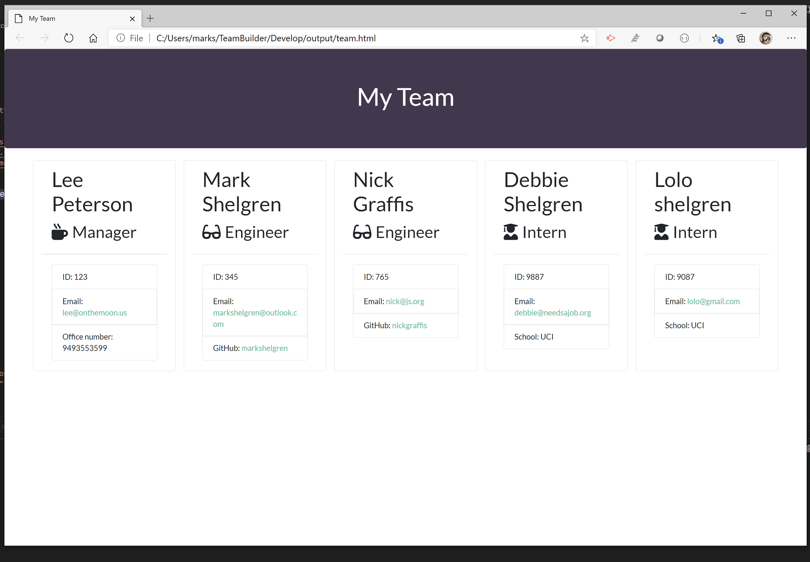

# TeamBuilder

Build and display a team including the team manager and team members

## Project Description

This application was developed to quickly generate a team and employees. Each teams consists of a manager and any combination of engineers and interns. It uses the inquirer package provided by NPM to lead the user through a series of prompts that enable the user to define the team manager, as many engineers and as many interns as needed. When the user is finished adding members to the team, an html page is generated with a list of the team members and their information.

## Installation Instructions

The project can be installed by "cloning" it from Gitub.

## Application Testing Instructions

The application includes some test criteria that must pass for application to work correctly. The application can also be tested by executing it and seeing if there is anything that does not work correctly.

## Usage Instructions

The application is fairly intuitive, especially once the application has been started.

## This application is licensed by

## Guidelines to Contribute

If you would like to contribute to the project, please contact Mark Shelgren at the address listed in the Questions section for Mark Shelgren.

## Question

Questions? Contact Mark Shelgren at: markshelgren@outlook.com

Github Profile: markshelgren

The following is a url to the page that can be executed.
https://markshelgren.github.io/TeamBuilder/

The following is a url to the Github repository.
https://github.com/markshelgren/TeamBuilder

